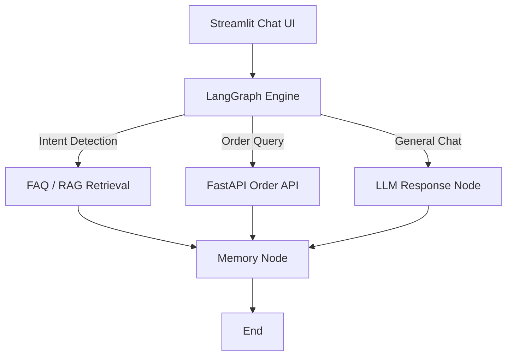

# 🛍️ ShopEase AI Assistant

> An **AI-powered e-commerce customer support assistant** built using **LangGraph**, **Groq LLM**, **FastAPI**, **Chroma (RAG)**, and **Streamlit**.  
> It answers FAQs, tracks orders via API, and provides human-like, context-aware assistance.

---

## 🚀 Features

✅ Retrieval-Augmented Generation (**RAG**) with Chroma  
✅ Integration with **FastAPI** (for order tracking via DuckDB)  
✅ **LangGraph multi-node architecture** for conversation flow  
✅ **Short-term memory** for multi-turn chat  
✅ **Streamlit UI** for interactive chat interface  
✅ Built and maintained by **Team Phoenix** 🔥

---

## 🧠 System Architecture



---

# ⚙️ Installation Guide

Follow these steps to set up and run the **ShopEase AI Assistant** on your local machine.

---

## 🧩 1️⃣ Prerequisites

Before you begin, ensure you have the following installed:

| Tool | Recommended Version | Description |
|-------|----------------------|-------------|
| **Python** | 3.10 or higher | Core runtime environment |
| **pip** | Latest | Python package manager |
| **Git** | Latest | For cloning the repository |
| **Virtualenv** | (Optional) | For isolated Python environments |

Verify your Python installation:

```bash
python --version
```

---

## 🧱 2️⃣ Clone the Repository

Clone the repository from GitHub:

```bash
git clone https://github.com/<your-username>/ShopEase-AI.git
cd ShopEase-AI
```

If you haven’t created the repository yet, initialize one:

```bash
git init
```

---

## 🧠 3️⃣ Create a Virtual Environment

It’s good practice to create a virtual environment to keep dependencies isolated.

### 🪟 Windows:
```bash
python -m venv langapi
langapi\Scripts\activate
```

### 🐧 Linux / 🍏 macOS:
```bash
python3 -m venv langapi
source langapi/bin/activate
```

Deactivate anytime:

```bash
deactivate
```

---

## 📦 4️⃣ Install Dependencies

Install all required Python libraries:

```bash
pip install -r requirements.txt
```

Or install manually:

```bash
pip install langchain langchain-community langgraph chromadb sentence-transformers streamlit fastapi duckdb uvicorn python-dotenv requests
```

---

# 🔐 5️⃣ Setup Environment Variables

Create a `.env` file in your **root directory** and add your API keys and configuration details.

---

### 🧾 Example `.env` File

```bash
# --- GROQ Configuration ---
GROQ_API_KEY=your_groq_api_key_here

# --- (Optional) Azure OpenAI Alternative ---
AZURE_OPENAI_API_KEY=your_azure_api_key
AZURE_OPENAI_ENDPOINT=https://your-resource.openai.azure.com/
AZURE_DEPLOYMENT_NAME=gpt-4o-mini
AZURE_OPENAI_API_VERSION=2024-02-01
```

---

### 💡 Tip

You can easily switch between **Groq** and **Azure OpenAI** by modifying the environment variables in your `.env` file.

- Use **GROQ_API_KEY** if you’re working with **Groq LLM**.
- Use **Azure OpenAI** keys if deploying in a Microsoft ecosystem.

---

### ⚠️ Note

> Ensure your `.env` file is added to your `.gitignore` to prevent exposing API keys publicly.

Add this line to your `.gitignore` file:

```bash
.env
```

---
# 🗂️ 6️⃣ Prepare Your Data

Before running the chatbot, you need to prepare your FAQ and policy documents for RAG (Retrieval-Augmented Generation).

---

### 📁 Create a Data Directory

In the root of your project, create a folder named `data/`.

Example structure:

```
ShopEase-AI/
│
├── data/
│   ├── faqs_orders.md
│   
│
├── scripts/
├── agent/
└── streamlit_app.py
```

---

### 🧾 Add Your FAQ Markdown Files

Inside the `data/` folder, add your FAQ and policy files in Markdown (`.md`) format.

At minimum, you should include:

```
data/faqs_orders.md
```

---

### ✍️ Example `faqs_orders.md` Content

Here’s a simple example you can copy:

```markdown
### Q: How do I track my order?
A: You can track your order using your order ID on the 'Track Order' page.

### Q: What is the return period?
A: You can return items within 30 days of delivery.

### Q: Can I modify my order after placing it?
A: Orders can be modified only within 2 hours of placement. Please contact customer support for assistance.

### Q: How will I receive my refund?
A: Refunds are processed to your original payment method within 5-7 business days.
```

---

### 💡 Tips for Writing Good FAQ Files

- Keep questions concise (start with “How”, “What”, or “Can”).  
- Provide clear and factual answers.  
- Use headings (`###`) for each question.  
- Avoid including large, irrelevant text blocks.  
- Group topics (orders, returns, policies) in separate files.

---

### ✅ Why It Matters

These markdown files are used by the **RAG ingestion pipeline** (`scripts/ingest_all.py`) to:
- Split the content into smaller chunks.
- Generate semantic embeddings.
- Store them in a **Chroma vector database** for fast retrieval during chat.

Without these files, the chatbot cannot answer FAQ-related questions.

---


# 🧮 7️⃣ Build the Vector Database (RAG Setup)

To enable your chatbot to answer FAQ-related queries using **Retrieval-Augmented Generation (RAG)**,  
you need to build a **Chroma vector database** from your Markdown files.

---

### ⚙️ Step 1: Run the Ingestion Script

Once your FAQ Markdown files are placed in the `data/` directory, run the ingestion script:

```bash
python scripts/ingest_all.py
```

This script will:
- Load all `.md` files from the `data/` folder  
- Split text into smaller chunks using **RecursiveCharacterTextSplitter**  
- Generate embeddings using **HuggingFace Sentence Transformers**  
- Store all embeddings in a persistent **Chroma vector database** under `chroma_db/`

---

### ✅ Expected Output

```
Starting FAQ ingestion process...
Loaded: faqs_orders.md (14500 chars)
Loaded: faqs_returns.md (9800 chars)
Loaded 3 FAQ documents.
Splitting text into smaller chunks...
Created 52 text chunks.
Generating embeddings using sentence-transformers/all-MiniLM-L6-v2...
Creating / Updating Chroma database at 'chroma_db'...
Successfully built Chroma DB with 52 chunks.
Database saved to: chroma_db/
```

---

# 🌐 8️⃣ Start the FastAPI Backend

The **FastAPI backend** powers real-time order tracking by serving order data from a DuckDB or mock database.  
This allows your chatbot to respond dynamically when users ask for their order details.

---

### ⚙️ Step 1: Navigate to the API Directory

Change directory to your API folder:

```bash
cd api
```

---

### ⚙️ Step 2: Start the FastAPI Server

Run the following command to start the FastAPI app:

```bash
uvicorn mock_api:app --reload --port 8001
```

- `--reload`: Automatically restarts the server when you make changes to the code.  
- `--port 8001`: Runs the API on port 8001 (you can change it if needed).

---

### ✅ Server Output Example

When the server starts successfully, you’ll see something like this in your terminal:

```
INFO:     Will watch for changes in these directories: ['C:\ShopEase-AI\api']
INFO:     Uvicorn running on http://127.0.0.1:8001 (Press CTRL+C to quit)
INFO:     Started reloader process [28764] using WatchFiles
INFO:     Started server process [19020]
INFO:     Waiting for application startup.
INFO:     Application startup complete.
```

---

### 🌍 Step 3: Verify the API is Running

Open your browser or Postman and visit:

```
http://127.0.0.1:8001
```

You should see a JSON response confirming the API is live:

```json
{
  "message": "ShopEase Mock API is running!"
}
```

---

### 🧾 Step 4: Test Order Retrieval Endpoint

Test the `/orders/{order_id}` endpoint by visiting:

```
http://127.0.0.1:8001/orders/P1060
```

✅ Example Response:

```json
{
  "order_id": "P1060",
  "Product_Name": "Blender",
  "Category": "Home Appliances",
  "Price": 1873.52,
  "Shipping_Method": "Standard",
  "Status": "In Godown"
}
```

---

### ⚠️ Troubleshooting

| Issue | Possible Cause | Solution |
|--------|----------------|----------|
| **404 Not Found** | Wrong port or endpoint path | Ensure FastAPI is running on `8001` and endpoint `/orders/{id}` exists |
| **Connection Refused** | API not started | Run `uvicorn main:app --reload --port 8001` |
| **Order Not Found** | Missing order in DuckDB or mock data | Check your database file or `main.py` data dictionary |

---

### 💡 Tip

You can customize your FastAPI app to fetch data from **DuckDB** like this:

```python
import duckdb

con = duckdb.connect("ecommerce.duckdb")
result = con.execute("SELECT * FROM products WHERE order_id = 'P1060'").fetchone()
print(result)
```

This approach integrates live order data with your chatbot API seamlessly.

---

### 🧠 Why This Step Matters

This FastAPI service is the backbone for real-time queries in your chatbot —  
it lets users ask questions like:

> "Where is my order P1060?"  
> "Has my Yoga Mat been shipped?"  

and get accurate, database-backed responses instantly.

---

# 💬 9️⃣ Launch the Streamlit Chat Interface

The **Streamlit frontend** provides a clean, interactive chat interface where users can communicate with the AI assistant in real time.  
It connects to the backend (FastAPI) and the RAG system to deliver accurate, human-like responses.

---

### ⚙️ Step 1: Navigate to the Project Root

Make sure you’re in the root folder of your project (where `ui/app.py` is located):


---

### ⚙️ Step 2: Run the Streamlit App

Start the chatbot interface by running:

```bash
streamlit run ui/app.py
```

Streamlit will automatically open your default browser.  
If not, manually visit:

```
http://localhost:8501
```

---

### ✅ Expected Output

In your terminal, you should see:

```
You can now view your Streamlit app in your browser.

  Local URL: http://localhost:8501
  Network URL: http://192.168.xx.xx:8501
```

---

### 🪄 Features of the Chat Interface

| Feature | Description |
|----------|-------------|
| 💬 **Conversational Chat Interface** | Engage naturally with the chatbot using a chat-style interface. |
| 🔗 **API-Integrated Order Tracking** | Fetch live order data from FastAPI (e.g., “Where is my order P1060?”). |
| 📚 **RAG-Based FAQ Answering** | Retrieve accurate responses using the Chroma vector database built from FAQs. |
| 🧠 **Context-Aware Responses** | Maintains short-term memory to enable smooth, multi-turn conversations. |
| 🧹 **Clear Chat Button** | Instantly clears the current chat history and memory buffer. |
| 🎨 **Minimalist Design** | Simple, elegant Streamlit UI with sidebar navigation and responsive layout. |

---

### 🧭 UI Overview

When the Streamlit app runs, you’ll see:

- **Sidebar Menu:**  
  - Displays ShopEase logo/title  
  - Lists chatbot capabilities (Orders, Returns, Payments, etc.)  
  - Includes “🧹 Clear Chat” button  

- **Main Chat Window:**  
  - Displays user and assistant messages in chat bubbles  
  - Shows typing spinner during AI response generation  
  - Supports markdown rendering for tables and formatted text  

---

### 🧠 Example Conversation

**User:**  
> “Where is my order P1060?”

**Assistant:**  
> Here are the details for order **P1060**:

| Field | Details |
|--------|----------|
| **Product** | Blender |
| **Category** | Home Appliances |
| **Price** | ₹1873.52 |
| **Shipping Method** | Standard |
| **Status** | In Godown |

---

### ⚠️ Troubleshooting

| Issue | Possible Cause | Fix |
|--------|----------------|-----|
| **Streamlit doesn’t open in browser** | Browser auto-launch disabled | Manually visit `http://localhost:8501` |
| **Chat repeats old messages** | Memory duplication issue | Ensure `memory.add()` is called only once per turn |
| **API errors in chat** | FastAPI not running | Start FastAPI with `uvicorn main:app --reload --port 8001` |
| **Slow responses** | Large model or many chunks in Chroma | Reduce chunk size or increase hardware resources |

---

### 🪶 Created By

Developed by **Team Phoenix** 🔥  
> “Empowering E-commerce with Intelligent Conversational AI.”

---


