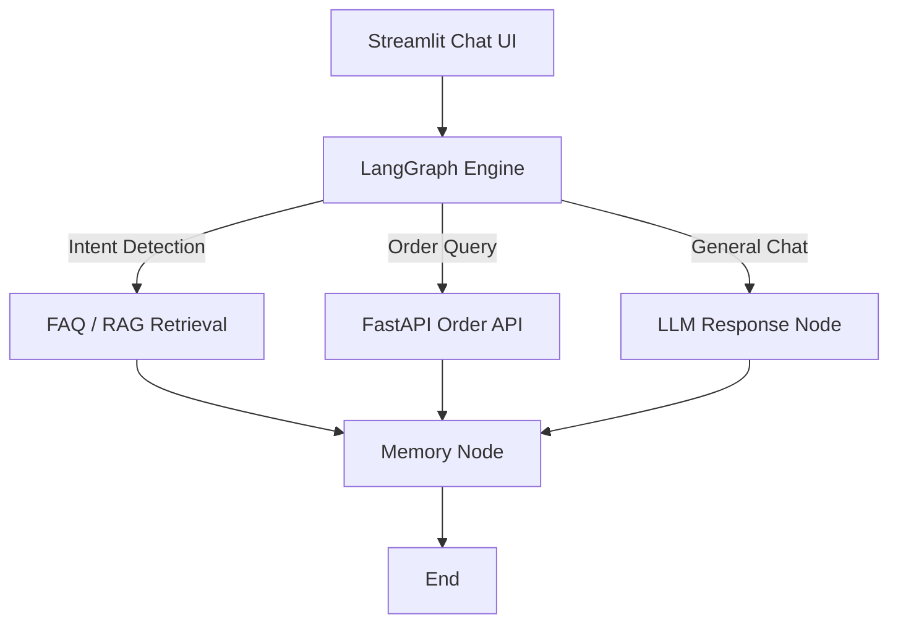

# 🛍️ ShopEase AI Assistant

> An **AI-powered e-commerce customer support assistant** built using **LangGraph**, **Groq LLM**, **FastAPI**, **Chroma (RAG)**, and **Streamlit**.  
> It answers FAQs, tracks orders via API, and provides human-like, context-aware assistance.

---

## 🚀 Features

✅ Retrieval-Augmented Generation (**RAG**) with Chroma  
✅ Integration with **FastAPI** (for order tracking via DuckDB)  
✅ **LangGraph multi-node architecture** for conversation flow  
✅ **Short-term memory** for multi-turn chat  
✅ **Streamlit UI** for interactive chat interface  
✅ **Sentiment-aware escalation (optional)**  
✅ Built and maintained by **Team Phoenix** 🔥

---

## 🧠 System Architecture



---

# ⚙️ Installation Guide

Follow these steps to set up and run the **ShopEase AI Assistant** on your local machine.

---

## 🧩 1️⃣ Prerequisites

Before you begin, ensure you have the following installed:

| Tool | Recommended Version | Description |
|-------|----------------------|-------------|
| **Python** | 3.10 or higher | Core runtime environment |
| **pip** | Latest | Python package manager |
| **Git** | Latest | For cloning the repository |
| **Virtualenv** | (Optional) | For isolated Python environments |

Verify your Python installation:

```bash
python --version
```

---

## 🧱 2️⃣ Clone the Repository

Clone the repository from GitHub:

```bash
git clone https://github.com/<your-username>/ShopEase-AI.git
cd ShopEase-AI
```

If you haven’t created the repository yet, initialize one:

```bash
git init
```

---

## 🧠 3️⃣ Create a Virtual Environment

It’s good practice to create a virtual environment to keep dependencies isolated.

### 🪟 Windows:
```bash
python -m venv langapi
langapi\Scripts\activate
```

### 🐧 Linux / 🍏 macOS:
```bash
python3 -m venv langapi
source langapi/bin/activate
```

Deactivate anytime:

```bash
deactivate
```

---

## 📦 4️⃣ Install Dependencies

Install all required Python libraries:

```bash
pip install -r requirements.txt
```

Or install manually:

```bash
pip install langchain langchain-community langgraph chromadb sentence-transformers streamlit fastapi duckdb uvicorn python-dotenv requests
```

---

# 🔐 5️⃣ Setup Environment Variables

Create a `.env` file in your **root directory** and add your API keys and configuration details.

---

### 🧾 Example `.env` File

```bash
# --- GROQ Configuration ---
GROQ_API_KEY=your_groq_api_key_here

# --- (Optional) Azure OpenAI Alternative ---
AZURE_OPENAI_API_KEY=your_azure_api_key
AZURE_OPENAI_ENDPOINT=https://your-resource.openai.azure.com/
AZURE_DEPLOYMENT_NAME=gpt-4o-mini
AZURE_OPENAI_API_VERSION=2024-02-01
```

---

### 💡 Tip

You can easily switch between **Groq** and **Azure OpenAI** by modifying the environment variables in your `.env` file.

- Use **GROQ_API_KEY** if you’re working with **Groq LLM**.
- Use **Azure OpenAI** keys if deploying in a Microsoft ecosystem.

---

### ⚠️ Note

> Ensure your `.env` file is added to your `.gitignore` to prevent exposing API keys publicly.

Add this line to your `.gitignore` file:

```bash
.env
```

---
# 🗂️ 6️⃣ Prepare Your Data

Before running the chatbot, you need to prepare your FAQ and policy documents for RAG (Retrieval-Augmented Generation).

---

### 📁 Create a Data Directory

In the root of your project, create a folder named `data/`.

Example structure:

```
ShopEase-AI/
│
├── data/
│   ├── faqs_orders.md
│   
│
├── scripts/
├── agent/
└── streamlit_app.py
```

---

### 🧾 Add Your FAQ Markdown Files

Inside the `data/` folder, add your FAQ and policy files in Markdown (`.md`) format.

At minimum, you should include:

```
data/faqs_orders.md
```

---

### ✍️ Example `faqs_orders.md` Content

Here’s a simple example you can copy:

```markdown
### Q: How do I track my order?
A: You can track your order using your order ID on the 'Track Order' page.

### Q: What is the return period?
A: You can return items within 30 days of delivery.

### Q: Can I modify my order after placing it?
A: Orders can be modified only within 2 hours of placement. Please contact customer support for assistance.

### Q: How will I receive my refund?
A: Refunds are processed to your original payment method within 5-7 business days.
```

---

### 💡 Tips for Writing Good FAQ Files

- Keep questions concise (start with “How”, “What”, or “Can”).  
- Provide clear and factual answers.  
- Use headings (`###`) for each question.  
- Avoid including large, irrelevant text blocks.  
- Group topics (orders, returns, policies) in separate files.

---

### ✅ Why It Matters

These markdown files are used by the **RAG ingestion pipeline** (`scripts/ingest_all.py`) to:
- Split the content into smaller chunks.
- Generate semantic embeddings.
- Store them in a **Chroma vector database** for fast retrieval during chat.

Without these files, the chatbot cannot answer FAQ-related questions.

---


🧮 7️⃣ Build the Vector Database (RAG Setup)

Run the ingestion script to build a Chroma vector database from FAQs:

python scripts/ingest_all.py

✅ Expected Output:

Starting FAQ ingestion process... Loaded 3 FAQ documents. Created 52 text chunks. Successfully built Chroma DB with 52 chunks. Database saved to: chroma_db/

🌐 8️⃣ Start the FastAPI Backend

Provides order data for real-time tracking.

Run the API server:

cd api uvicorn main:app --reload --port 8001

✅ The API will start on:

http://127.0.0.1:8001

Test it:

http://127.0.0.1:8001/orders/P1060

💬 9️⃣ Launch the Streamlit Chat Interface

Go back to the root folder and start the Streamlit frontend:

streamlit run streamlit_app.py

🪄 Features:

Conversational chat interface

API-integrated order tracking

RAG-based FAQ answering

Context-aware responses

“Clear Chat” button & memory retention

🧠 🔟 Test the Chatbot

Try your first query:

“Where is my order P1060?”

✅ Example Response:

Field Details Product Name Blender Category Home Appliances Price ₹1873.52 Shipping Method Standard Status In Godown 🔄 11️⃣ Optional: Use DuckDB as Backend Database

DuckDB stores product and order data for your FastAPI.

Example:

import duckdb con = duckdb.connect("ecommerce.duckdb") con.execute("CREATE TABLE products AS SELECT * FROM read_csv_auto('orders.csv');")

🧹 12️⃣ (Optional) Clean Build

If you need to rebuild your vector DB or clear cache:

rm -rf chroma_db/ python scripts/ingest_all.py

✅ 13️⃣ Verify Everything is Running Component Command Status URL FastAPI Backend uvicorn main:app --reload --port 8001 http://127.0.0.1:8001

Streamlit Frontend streamlit run streamlit_app.py http://localhost:8501

Chroma DB auto-created chroma_db/ folder 🪶 14️⃣ You're All Set!

Your ShopEase AI Assistant is live 🎉 You can now ask:

🗣️ “What’s your return policy?” 🗣️ “Where is my order 102?” 🗣️ “Can I cancel my recent purchase?”

🧾 Troubleshooting Issue Possible Fix Error loading data/faqs_orders.md Ensure .md files are UTF-8 encoded FastAPI returns 404 Verify FastAPI is running on port 8001 Streamlit chat repeats messages Check if memory.add() is being duplicated ModuleNotFoundError Reinstall dependencies with pip install -r requirements.txt 🪶 Credits

Developed by Team Phoenix 🔥

“Innovating the future of AI-powered commerce.”

Built with 💙 using:

LangGraph + LangChain

Groq LLM / Azure OpenAI

FastAPI + DuckDB

Streamlit

ChromaDB
